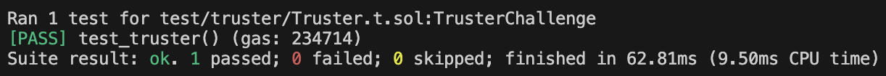
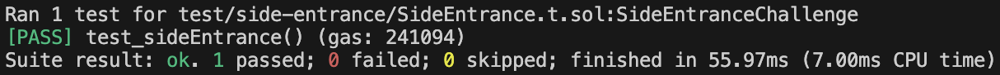
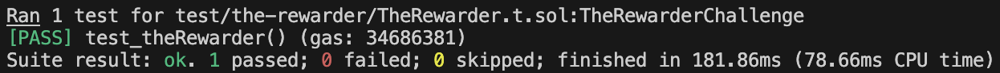
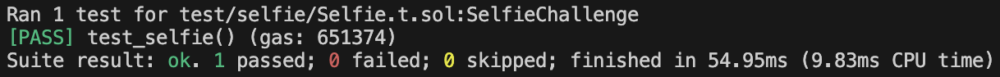
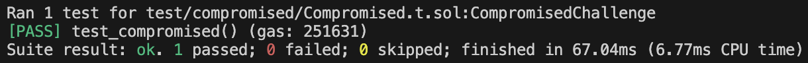

# Damn Vulnerable DeFi

This folder contains security reports for each **Damn Vulnerable DeFi v4.1.0** challenge, detailing the vulnerability and corresponding exploit strategy.

**Damn Vulnerable DeFi** is a training ground for smart contract security. It contains challenges featuring flashloans, price oracles, governance, NFTs, DEXs, lending pools, smart contract wallets, timelocks, vaults, meta-transactions, token distributions, upgradeability, and more!

Additional details can be found on the website and in the repository linked above.

## Rules

- You must always use the player account.
- You must not modify the challenges' initial nor final conditions.
- You can code and deploy your own smart contracts.
- You can use Foundry's cheatcodes to advance time when necessary.
- You can import external libraries that aren't installed, although it shouldn't be necessary.

## Challenges

### 1. Unstoppable

### 2. Naive Receiver

### 3. Truster

### 4. Side Entrance

### 5. The Rewarder

### 6. Selfie

### 7. Compromised

